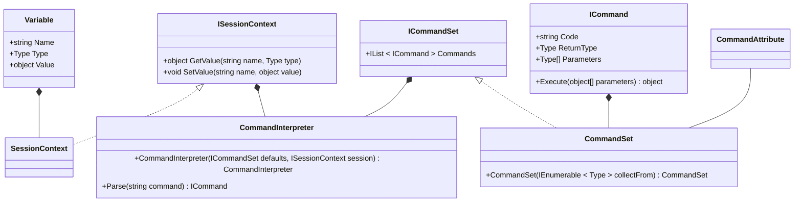

```mermaid
classDiagram

    
    class Variable{
        +string Name
        +Type Type
        +object Value
    }

    
    
    class ISessionContext{
        +object GetValue(string name, Type type)
        +void SetValue(string name, object value)
    }

    class SessionContext{

    }
    ISessionContext <|.. SessionContext
    Variable *-- SessionContext


    class CommandInterpreter{
        +CommandInterpreter(ICommandSet defaults, ISessionContext session) CommandInterpreter

        +Parse(string command) ICommand
    }
    ISessionContext *-- CommandInterpreter
    ICommandSet *-- CommandInterpreter
    


    class ICommandSet{
        +IList &lt; ICommand &gt; Commands
    }

    class CommandSet{
        +CommandSet(IEnumerable &lt; Type &gt; collectFrom) CommandSet
    }
    ICommandSet <|.. CommandSet

    ICommand *-- CommandSet
    CommandAttribute -- CommandSet


    class CommandAttribute{

    }

    class ICommand{
        +string Code

        +Type ReturnType

        +Type[] Parameters


        +Execute(object[] parameters) object
    }


```