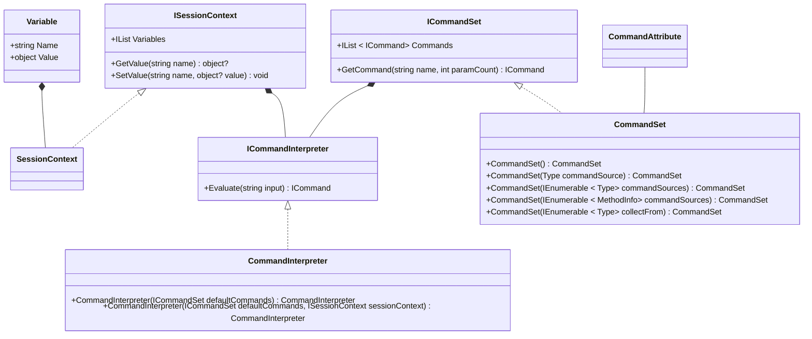
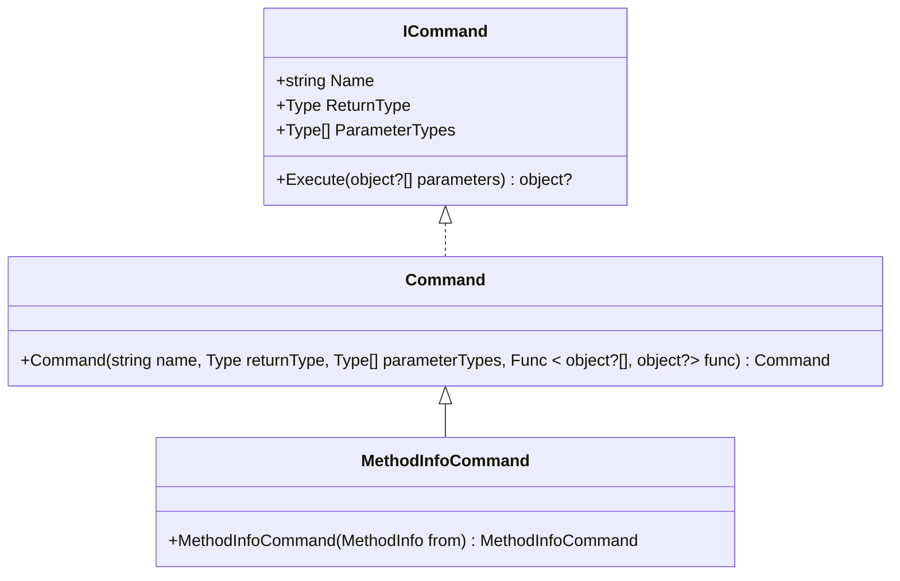
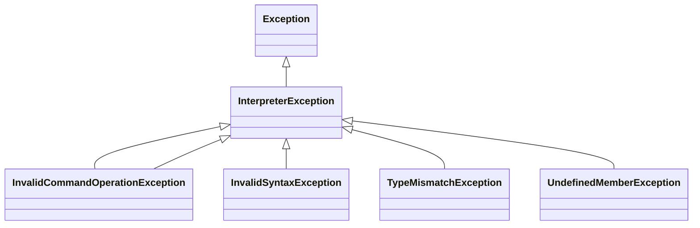

# Public API
## Interpreter structure.

```mermaid
classDiagram

    
    class Variable{
        +string Name
        +object Value
    }

    
    
    class ISessionContext{
        +IList<Variable> Variables

        +GetValue(string name) object? 
        +SetValue(string name, object? value) void 
    }

    class SessionContext{

    }
    ISessionContext <|.. SessionContext
    Variable *-- SessionContext


    class ICommandInterpreter{
        +Evaluate(string input) ICommand
    }
    ISessionContext *-- ICommandInterpreter
    ICommandSet *-- ICommandInterpreter

    class CommandInterpreter{
        +CommandInterpreter(ICommandSet defaultCommands) CommandInterpreter

        +CommandInterpreter(ICommandSet defaultCommands, ISessionContext sessionContext) CommandInterpreter
      
    }
    ICommandInterpreter <|.. CommandInterpreter
    
    


    class ICommandSet{

        +GetCommand(string name, int paramCount) ICommand
        +IList &lt ICommand> Commands
    }

    class CommandSet{
        +CommandSet() CommandSet
        +CommandSet(Type commandSource) CommandSet
        +CommandSet(IEnumerable &lt Type> commandSources) CommandSet
        +CommandSet(IEnumerable &lt MethodInfo> commandSources) CommandSet

        +CommandSet(IEnumerable &lt Type> collectFrom) CommandSet
    }
    ICommandSet <|.. CommandSet

    CommandAttribute -- CommandSet


    class CommandAttribute{

    }
```

## ICommands

```mermaid
classDiagram
    class ICommand{
        +string Name
        +Type ReturnType
        +Type[] ParameterTypes

        +Execute(object?[] parameters) object?
    }

    class Command{
        +Command(string name, Type returnType, Type[] parameterTypes, Func &lt object?[], object?> func) Command
    }
    ICommand <|.. Command

    class MethodInfoCommand{
        +MethodInfoCommand(MethodInfo from) MethodInfoCommand
    }
    Command <|-- MethodInfoCommand

```

## Exceptions

```mermaid
classDiagram

    class InterpreterException{

    }
    Exception <|-- InterpreterException
    InterpreterException <|-- InvalidCommandOperationException
    InterpreterException <|-- InvalidSyntaxException
    InterpreterException <|-- InvalidCommandOperationException
    InterpreterException <|-- TypeMismatchException
    InterpreterException <|-- UndefinedMemberException

```