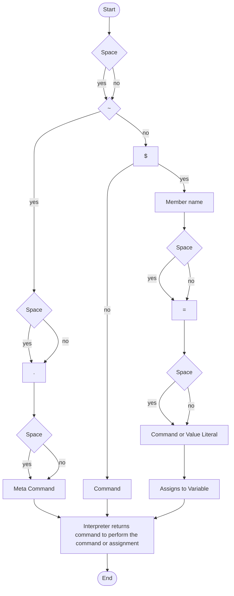
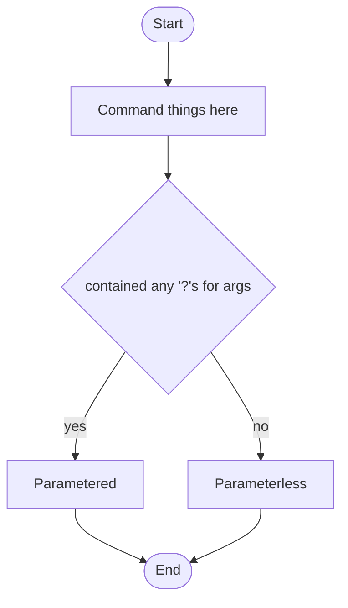

# Command evaluat tree

```mermaid
flowchart

    0([Start])
    0 --> s1

    s1{Space}
    s1 -->|yes| metaCmdChar
    s1 -->|no| metaCmdChar


    metaCmdChar{~}
    metaCmdChar -->|yes|s4
    metaCmdChar -->|no|varC

    varC[$]
    varC -->|yes|mName1
    varC -->|no|isCmd

    s4{Space}
    s4 -->|yes| p1
    s4 -->|no| p1
    
    p1[.]
    p1 --> s5

    s5{Space}
    s5 -->|yes| metaCmd
    s5 -->|no| metaCmd

    metaCmd[Meta Command]
    metaCmd --> valRetrn

    mName1[Member name]
    mName1 --> s2

    s2{Space}
    s2 -->|yes| assignOp
    s2 -->|no| assignOp

    assignOp[=]
    assignOp -->s3

    isCmd[Command]
    isCmd --> valRetrn

    s3{Space}
    s3 -->|yes| c1
    s3 -->|no| c1

    c1[Command or Value Literal]
    c1 --> ass

    ass[Assigns to Variable]
    ass --> valRetrn

    valRetrn[Interpreter returns command to perform the command or assignment]
    valRetrn --> 0r

    0r([End])


```

## Commmand

```mermaid
flowchart
    c0([Start])
    c0 --> temp1

    temp1[Command things here]
    temp1 --> hasQ

    hasQ{contained any '?'s for args}
    hasQ -->|yes|cl
    hasQ -->|no|ce

    cl[Parametered]
    cl --> c0r

    ce[Parameterless]
    ce --> c0r

    c0r([End])
```